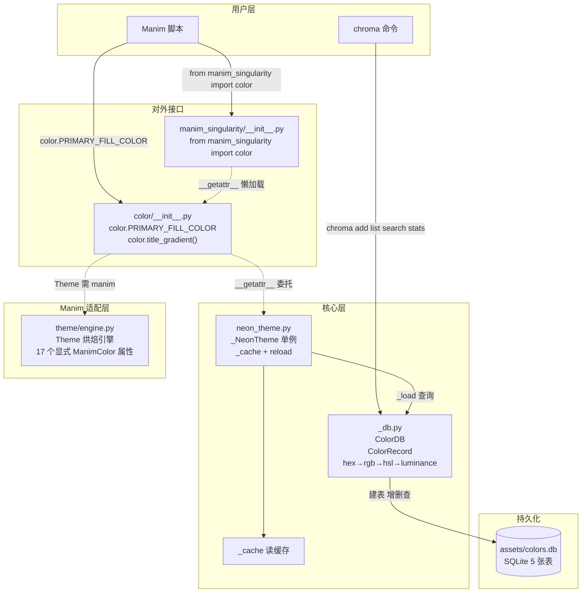

# Module: `manim_singularity.color` — ChromaVault

颜色数据库系统，用于持续收藏颜色并灵活组合成不同视觉主题。

**设计理念**：颜色只有一个来源——SQLite 数据库。无内置 seed/fallback，数据库由你手动管理。参考 seed 文件：`<项目根>/../chroma_seed.py`

**零依赖**：`ColorDB` 和 `ColorRecord` 仅用 Python 标准库，`chroma` CLI 和 `color` 颜色库不需要安装 manim。

---

## 架构总览



### 调用流程

```
首次使用（数据库已有 Neon 主题）：
  color.PRIMARY_FILL_COLOR
    → __getattr__ → _NeonTheme.__getattr__
    → _cache 未命中 → _load() 从 DB 加载 "Neon" 主题
    → _cache["PRIMARY_FILL_COLOR"] = "#00E5FF"
    → 返回 "#00E5FF"

第二次：
  _cache 直接命中 → 不碰数据库

数据库无 Neon 主题时 → 抛出 AttributeError

color.reload() → 清空 _cache → 重新 _load()
```

---

## 快速开始

```python
from manim_singularity import color

circle.set_color(color.PRIMARY_FILL_COLOR)
title.set_color_by_gradient(*color.title_gradient())
body.set_color(color.TEXT_COLOR)
```

---

## 1. `color` 颜色库（全局单例，推荐方式）

### 场景色

| 属性 | 默认色值 | 用途 |
|------|---------|------|
| `color.BACKGROUND_COLOR` | `#0D1117` | 场景背景色 |
| `color.SURFACE_COLOR` | `#161B22` | 卡片/面板底色 |

### 网格色

| 属性 | 默认色值 | 用途 |
|------|---------|------|
| `color.GRID_LINE_COLOR` | `#1A2639` | 网格线色 |
| `color.GRID_AXIS_COLOR` | `#FFFFFF` | 坐标轴线色 |

### 图形填充色

| 属性 | 默认色值 | 用途 |
|------|---------|------|
| `color.PRIMARY_FILL_COLOR` | `#00E5FF` | 主要图形填充色 |
| `color.SECONDARY_FILL_COLOR` | `#006680` | 次要图形填充色 |
| `color.ACCENT_FILL_COLOR` | `#FFD700` | 点缀/高亮填充色 |

### 文字色

| 属性 | 默认色值 | 用途 |
|------|---------|------|
| `color.TITLE_COLOR` | `#00E5FF` | 标题文字色 |
| `color.TITLE_GRADIENT_END_COLOR` | `#0077FF` | 标题渐变末端色 |
| `color.TEXT_COLOR` | `#E6E6E6` | 正文文字色 |
| `color.TEXT_MUTED_COLOR` | `#8B949E` | 弱化文字色 |

### 语义色

| 属性 | 默认色值 | 用途 |
|------|---------|------|
| `color.SUCCESS_COLOR` | `#00FF88` | 成功/正向色 |
| `color.DANGER_COLOR` | `#FF6B6B` | 危险/错误色 |
| `color.WARNING_COLOR` | `#FFD700` | 警告色 |
| `color.INFORMATION_COLOR` | `#58A6FF` | 信息色 |

### 基础色

| 属性 | 默认色值 | 用途 |
|------|---------|------|
| `color.WHITE_COLOR` | `#FFFFFF` | 纯白 |
| `color.BLACK_COLOR` | `#000000` | 纯黑 |

### 便捷方法

```python
color.title_gradient()   # → ("#00E5FF", "#0077FF") = (TITLE_COLOR, TITLE_GRADIENT_END_COLOR)
color.reload()           # → 清空缓存重新加载
```

### 使用示例

```python
from manim import Text, Circle, Rectangle
from manim_singularity import color

scene.camera.background_color = color.BACKGROUND_COLOR

circle = Circle(color=color.PRIMARY_FILL_COLOR)
grid = NumberPlane(background_line_style={"stroke_color": color.GRID_LINE_COLOR})

title = Text("标题").set_color_by_gradient(*color.title_gradient())
body = Text("正文", color=color.TEXT_COLOR)
muted = Text("备注", color=color.TEXT_MUTED_COLOR)

success = Text("成功", color=color.SUCCESS_COLOR)
danger = Text("错误", color=color.DANGER_COLOR)
```

---

## 2. `ColorDB` — 数据库核心

SQLite 数据库，默认位置 `<项目根>/assets/colors.db`。

### 构造

```python
from manim_singularity import ColorDB
db = ColorDB()
db = ColorDB("/path/to/custom.db")
```

### 颜色增删查

```python
cid = db.add("primary_fill", "#00E5FF", tags=["强调", "青色系"])
rec = db.get_by_name("primary_fill")
rec.name           # "primary_fill"
rec.hex_code       # "#00E5FF"
rec.rgb            # (0, 229, 255)
rec.hsl            # (186.1, 100.0, 50.0)
rec.wcag_luminance # 0.6326

db.get_by_hex("#00E5FF")
db.all()
db.count()
db.add_tag_to_color("primary_fill", "已使用")
```

### 标签搜索

```python
db.search_by_tags(["强调", "青色系"], match_all=True)
db.search_by_tags(["强调", "青色系"], match_all=False)
```

### 色相搜索

```python
db.search_by_hue_range(180, 220)
db.search_similar("#00E5FF", tolerance=15)
```

### 主题管理

```python
db.create_theme("赛博蓝夜")
db.set_theme_color("赛博蓝夜", "primary_fill", "primary_fill")
db.set_theme_color("赛博蓝夜", "background", "background")

theme_data = db.get_theme("赛博蓝夜")
db.list_themes()
db.close()
```

---

## 3. `ColorRecord` — 颜色数据类

| 字段 | 类型 | 说明 |
|------|------|------|
| `id` | `int` | 自增主键 |
| `name` | `str` | 颜色名称（唯一） |
| `hex_code` | `str` | 色值 |
| `rgb` | `tuple` | RGB 0-255 |
| `hsl` | `tuple` | HSL (h°, s%, l%) |
| `wcag_luminance` | `float` | WCAG 2.0 相对亮度 |

```python
record.to_manim_color()  # → ManimColor
```

---

## 4. `Theme` — 主题烘焙引擎

将 `ColorDB` 主题烘焙为 `ManimColor`。**需要 manim**。

17 个标准化属性，命名与 `color` 颜色库一致：

```python
from manim_singularity import ColorDB, Theme

theme = Theme(db, "赛博蓝夜")

theme.BACKGROUND_COLOR         # ManimColor
theme.PRIMARY_FILL_COLOR
theme.TEXT_COLOR
theme.SUCCESS_COLOR

# 全部角色
theme.all()  # → {role: ManimColor}
```

缺少必需角色时构造抛出 `ValueError`。

---

## 5. CLI 命令行

**入口**：`chroma`（需 `pip install -e .` 注册）。零 manim 依赖。

### 颜色操作

```bash
chroma add primary_fill "#00E5FF" --tags 强调 青色系
chroma list
chroma search 背景
chroma stats
```

### 主题操作

```bash
chroma create-theme "赛博蓝夜" --desc "暗色科技风"
chroma set-role "Neon" background background
chroma list-themes
```

### 删除操作

```bash
chroma delete my_red               # 删除颜色
chroma delete-theme "Neon"          # 删除主题
```

### 一键初始化

```bash
python3 chroma_seed.py    # 17 色 + Neon 主题一次性就绪
```

---

## 6. 标签系统

```python
from manim_singularity.color.core.tags import TagCategory, StandardTags

StandardTags.HUE_BLUE     # ("blue", TagCategory.HUE)
StandardTags.MOOD_TECH    # ("tech", TagCategory.MOOD)
StandardTags.all()        # → 全部标准标签
```

---

## 7. 首次设置指南

### 方式 A：一键初始化（推荐）

```bash
python3 chroma_seed.py
```

自动完成：17 色写入 → 创建 "Neon" 主题 → 绑定所有角色。

### 方式 B：分步操作

```bash
# 1. 添加颜色
chroma add background "#0D1117"
chroma add primary_fill "#00E5FF"
# ... 参考 chroma_seed.py

# 2. 创建主题并绑定角色
chroma create-theme "Neon"
chroma set-role "Neon" background background
chroma set-role "Neon" primary_fill primary_fill
# ... 全部 17 个角色
```

### 验证

```python
from manim_singularity import color
print(color.PRIMARY_FILL_COLOR)   # → #00E5FF
```

---

## 8. 迁移指南

| 旧 `NeonTheme.X` | 新 `color.X` |
|---|---|
| `BG_COLOR` | `BACKGROUND_COLOR` |
| `COLOR_WHITE` | `WHITE_COLOR` |
| `COLOR_ELLIPSE` | `PRIMARY_FILL_COLOR` |
| `COLOR_GRID` | `GRID_LINE_COLOR` |
| `TEXT` | `TEXT_COLOR` |
| `*COLOR_TITLE` | `*title_gradient()` |

---

## 9. 数据库文件

默认位置：`<项目根>/assets/colors.db`（已 `.gitignore`）。
首次运行自动建库建表，颜色需手动添加。
