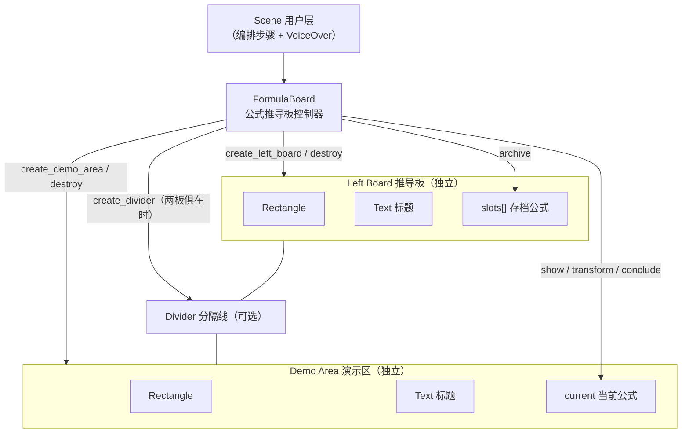

# Module: `manim_singularity.formula_board`

`FormulaBoard` 是公式推导板控制器，提供左侧存档推导板 + 右侧变换演示区的完整方案。
两块板子各自独立，可自由组合（仅左、仅右、双板）。

---

## 架构总览



---

## 文件结构

```
manim_singularity/
  formula_board.py    # FormulaBoard 类
```

---

## 构造参数

### `__init__(scene, *, ...)`

| 参数分组 | 参数 | 类型 | 默认 | 说明 |
|----------|------|------|------|------|
| **布局尺寸** | `board_width_ratio` | `float` | `0.45` | 面板宽度占帧宽比 |
| | `board_height_ratio` | `float` | `0.75` | 面板高度占帧高比 |
| | `board_buff` | `float` | `0.3` | 面板距边缘间距 |
| | `board_shift_x` | `float` | `0.0` | 面板水平偏移 |
| | `board_shift_y` | `float` | `0.5` | 面板垂直偏移 |
| **标题文字** | `board_title_text` | `str` | `"推导过程"` | 左侧标题 |
| | `demo_title_text` | `str` | `"变换演示"` | 右侧标题 |
| | `board_title_size` | `float` | `28` | 左侧标题字号 |
| | `demo_title_size` | `float` | `28` | 右侧标题字号 |
| **颜色接口** | `board_stroke_color` | `str` | `theme.PRIMARY_FILL_COLOR` | 左侧板描边色 |
| | `board_fill_color` | `str` | `theme.MUTED_TEXT_COLOR` | 左侧板填充色 |
| | `board_fill_opacity` | `float` | `0.3` | 左侧板填充不透明度 |
| | `demo_stroke_color` | `str` | `theme.MUTED_TEXT_COLOR` | 右侧板描边色 |
| | `demo_fill_color` | `str` | `BLACK` | 右侧板填充色 |
| | `demo_fill_opacity` | `float` | `0.3` | 右侧板填充不透明度 |
| | `divider_color` | `str` | `theme.MUTED_TEXT_COLOR` | 分隔线颜色 |
| | `divider_opacity` | `float` | `0.5` | 分隔线不透明度 |
| | `board_title_color` | `str` | `theme.PRIMARY_FILL_COLOR` | 左侧标题颜色 |
| | `demo_title_color` | `str` | `theme.WARNING_COLOR` | 右侧标题颜色 |
| | `formula_color` | `str` | `theme.WARNING_COLOR` | 公式默认颜色 |
| | `formula_gradient` | `tuple` | `None` | 公式默认渐变色 |
| **排版间距** | `title_board_gap` | `float` | `0.15` | 标题与面板间距 |
| | `board_title_gap` | `float` | `0.6` | 存档首行距标题间距 |
| | `slot_spacing` | `float` | `0.85` | 存档公式行间距 |
| | `arc_angle` | `float` | `-PI/8` | 存档飞行弧线弧度 |
| | `formula_font_size` | `float` | `36` | 公式默认字号 |
| **动画时间** | `layout_run_time` | `float` | `1.2` | 面板创建动画时长 |
| | `show_run_time` | `float` | `0.8` | show() 动画时长 |
| | `transform_run_time` | `float` | `1.2` | transform() 动画时长 |
| | `archive_run_time` | `float` | `0.5` | archive() 飞行时长 |
| **动画策略** | `archive_animation` | `str` | `"arc_fly"` | 存档动画类型 |
| | `conclude_emphasis` | `str` | `"circumscribe"` | 结论强调动画类型 |
| **生命周期钩子** | `on_before_show` | `Callable \| None` | `None` | `show()` 播放动画前回调 |
| | `on_after_show` | `Callable \| None` | `None` | `show()` 播放动画后回调 |
| | `on_before_transform` | `Callable \| None` | `None` | `transform()` 播放动画前回调 |
| | `on_after_transform` | `Callable \| None` | `None` | `transform()` 播放动画后回调 |
| | `on_before_archive` | `Callable \| None` | `None` | `archive()` 播放动画前回调 |
| | `on_after_archive` | `Callable \| None` | `None` | `archive()` 播放动画后回调 |
| | `on_before_conclude` | `Callable \| None` | `None` | `conclude()` 播放动画前回调 |
| | `on_after_conclude` | `Callable \| None` | `None` | `conclude()` 播放动画后回调 |

**回调签名约定**：
- `on_before_*(mob, **context) -> Mobject | list[Mobject] | None`
  - 接收即将操作的 Mobject，返回的 Mobject 会被自动 play
- `on_after_*(mob, **context) -> Mobject | list[Mobject] | None`
  - 接收已完成操作的 Mobject，返回的 Mobject 会被自动 play

**`context` 内容**：
- `show` 相关：`{"tex": str, "font_size": float, "color": str}`
- `transform` 相关：`{"target_tex": str, "path_arc": float}`
- `archive` 相关：`{"source_mob": Mobject, "slot_index": int}`
- `conclude` 相关：`{"tex": str, "gradient": tuple}`

```python
def add_sparkle(mob, **ctx):
    """存档后加粒子特效"""
    sparkles = Sparkles(mob, color=GOLD)
    return sparkles  # 框架自动 play

fb = FormulaBoard(self, on_after_archive=add_sparkle)
```

**`archive_animation` 可选值**：
- `"arc_fly"`（默认）— 弧线飞行 + 缩放，当前行为
- `"fade_in"` — 目标位置直接 FadeIn
- `"write_in"` — 目标位置 Write 动画

**`conclude_emphasis` 可选值**：
- `"circumscribe"`（默认）— 环绕描边强调，当前行为
- `"indicate"` — Indicate 缩放强调
- `"flash"` — 背景闪光强调

---

## 属性

| 属性 | 类型 | 读写 | 说明 |
|------|------|------|------|
| `current` | `MathTex \| None` | 可读写 | 演示区当前公式 |
| `slot_count` | `int` | 只读 | 已存档公式数量 |
| `slots` | `list[Mobject]` | 只读 | 存档公式列表（返回副本） |
| `board` | `Rectangle \| None` | 只读 | 左侧推导板矩形 |
| `demo` | `Rectangle \| None` | 只读 | 右侧演示区矩形 |
| `divider` | `Line \| None` | 只读 | 中间分隔线 |
| `board_title` | `Text \| None` | 只读 | 左侧标题文字 |
| `demo_title` | `Text \| None` | 只读 | 右侧标题文字 |
| `board_created` | `bool` | 只读 | 左侧板是否已创建 |
| `demo_created` | `bool` | 只读 | 演示区是否已创建 |

---

## 生命周期方法

### `create_left_board(*, centered=False)`

| 项目 | 说明 |
|------|------|
| **参数** | `centered` — True 面板居中，False 靠左对齐 |
| **返回值** | `None` |
| **动画流程** | ① 静默清除旧面板（若有）→ ② Create Rectangle 0.6s → ③ Write 标题 0.6s → ④ set_fill 填充背景 0.8s |
| **重复调用** | 自动静默清除旧面板再重建（无闪烁残留） |
| **适用场景** | 仅需存档推导步骤时使用；与 `create_demo_area()` 配合实现双板 |

### `create_demo_area(*, centered=False)`

| 项目 | 说明 |
|------|------|
| **参数** | `centered` — True 面板居中，False 靠右对齐 |
| **返回值** | `None` |
| **动画流程** | ① 静默清除旧面板（若有）→ ② Create Rectangle 0.6s → ③ Write 标题 0.6s → ④ set_fill 填充背景 0.8s |
| **重复调用** | 自动静默清除旧面板再重建 |
| **适用场景** | 仅需展示变换过程时使用 |

### `create_divider()`

| 项目 | 说明 |
|------|------|
| **参数** | 无 |
| **返回值** | `None` |
| **前置条件** | 左右两板都必须已创建，否则静默跳过 |
| **动画流程** | Create Line 0.5s |
| **重复调用** | 先静默清除旧分隔线再重建 |
| **适用场景** | 双板布局时增加视觉分隔 |

### `destroy_left_board()`

| 项目 | 说明 |
|------|------|
| **参数** | 无 |
| **返回值** | `None` |
| **动画流程** | 一次性 FadeOut 面板 + 标题 + 所有存档公式（各 0.3s） |
| **副作用** | 重置 `board`、`board_title` 为 `None`，清空 `slots[]` |

### `destroy_demo_area()`

| 项目 | 说明 |
|------|------|
| **参数** | 无 |
| **返回值** | `None` |
| **动画流程** | 一次性 FadeOut 面板 + 标题 + current 当前公式（各 0.3s） |
| **副作用** | 重置 `demo`、`demo_title`、`current` 为 `None` |

### `destroy_divider()`

| 项目 | 说明 |
|------|------|
| **参数** | 无 |
| **返回值** | `None` |
| **动画流程** | FadeOut 分隔线（0.2s） |
| **副作用** | 重置 `divider` 为 `None` |

### `dissolve()`

| 项目 | 说明 |
|------|------|
| **参数** | 无 |
| **返回值** | `None` |
| **动画流程** | 一次性 FadeOut 全部元素（面板、标题、分隔线、存档公式、当前公式，各 0.25s） |
| **副作用** | 完全重置所有状态为构造后初始值，可重新 `create_*` |
| **vs destroy** | `dissolve()` 是整体销毁，`destroy_*()` 是单项销毁 |

### `reset(*, board_title=None, demo_title=None)`

| 项目 | 说明 |
|------|------|
| **参数** | `board_title` — 新左侧标题（None=不变）；`demo_title` — 新右侧标题（None=不变）|
| **返回值** | `None` |
| **动画流程** | ① 静默移除所有存档公式 → ② 静默移除 current → ③ 若有新标题，ReplacementTransform 0.4s 替换 |
| **副作用** | 保留 UI 面板，仅清内容。可立即开始新的推导循环 |
| **适用场景** | 同一布局下开始新章节推导，避免重复 create/destroy |

---

## 公式操作方法

### `show(tex, *, font_size=None, color=None, gradient=None, **kwargs) -> MathTex`

在演示区展示一个新公式（Write 动画）。创建后自动设为 `current`。

| 项目 | 说明 |
|------|------|
| **参数** | `tex` — LaTeX 公式字符串（必填） |
| | `font_size` — 字号，默认构造参数 `formula_font_size=36` |
| | `color` — 颜色，默认构造参数 `formula_color=theme.WARNING_COLOR` |
| | `gradient` — 渐变色元组如 `(GOLD, YELLOW)`，覆盖单色 |
| | `**kwargs` — 传递给 `MathTex()` 的额外参数 |
| **返回值** | `MathTex` 对象（同时设为 `current`） |
| **实现** | 内部调用 `show_mobject()`，即 `self.show_mobject(MathTex(tex, ...))` |
| **动画流程** | Write 动画（默认 0.8s）→ 公式定位到演示区中心 |
| **定位** | 优先定位到 `demo`（演示区中心），若不存在则定位到 `board`（推导板中心） |
| **边界行为** | 无任何面板时公式出现在原点 |

```python
fb.show(r"\frac{d}{dx} a^x = \lim_{h \to 0} \frac{a^{x+h} - a^x}{h}")
fb.show(r"e^{i\pi} + 1 = 0", font_size=48, gradient=(GOLD, RED))
```

### `show_mobject(mob, *, run_time=None) -> Mobject`

将任意 Mobject 放入演示区并播放 Write 动画。`show()` 的内部实现即调用此方法。

| 项目 | 说明 |
|------|------|
| **参数** | `mob` — 任意 Mobject（必填） |
| | `run_time` — 动画时长，默认 `show_run_time` |
| **返回值** | 传入的 Mobject（同时设为 `current`） |
| **动画流程** | Write 动画 → 定位到演示区中心 |
| **定位** | 同 `show()`：优先 `demo`，其次 `board`，无面板时原点 |
| **适用场景** | 需要在演示区展示非公式内容（Text、ImageMobject、SVG、3D 物体等） |

```python
# 展示图片
img = ImageMobject("graph.png").scale(0.8)
fb.show_mobject(img)

# 展示自定义文本
title = Text("第三章", font_size=48, color=BLUE)
fb.show_mobject(title)
```

### `transform(tex, *, font_size=None, color=None, gradient=None, path_arc=0, transform_mismatches=True, **kwargs) -> MathTex`

从 `current` 公式通过 `TransformMatchingTex` 变换到新公式。

| 项目 | 说明 |
|------|------|
| **参数** | `tex` — 目标 LaTeX 字符串（必填） |
| | `font_size` — 字号，默认 `formula_font_size` |
| | `color` — 颜色，默认 `formula_color` |
| | `gradient` — 渐变色元组 |
| | `path_arc` — 变换路径弧度，默认 0 |
| | `transform_mismatches` — 是否变换不匹配部分，默认 True |
| **返回值** | 新 `MathTex` 对象（设为 `current`） |
| **动画流程** | TransformMatchingTex（默认 1.2s）→ 移除旧 `current` → 设新公式为 `current` |
| **边界行为** | `current` 为 None 时自动降级为 `show()`，不会崩溃 |

```python
fb.transform(r"{{a^x}} \cdot \frac{{{a^h}} - 1}{{h}}")
fb.transform(r"{{a}} = \lim_{ {{h \to 0}} } (1 + {{h}})^{ {{1/h}} }", path_arc=PI/3)
```

**LaTeX 分组说明**：用 `{{...}}` 包裹的分组会在 TransformMatchingTex 中保持"原位匹配"，仅未包裹部分发生变换，实现流畅的局部动画。

### `archive(mob=None) -> Mobject`

克隆指定公式并飞入左侧存档板，缩放到 0.75 倍。动画类型由构造参数 `archive_animation` 控制。

| 项目 | 说明 |
|------|------|
| **参数** | `mob` — 要存档的 Mobject，默认 `current` |
| **返回值** | 存档后的克隆体（已加入场景，可从 `slots` 列表获取） |
| **动画流程** | 根据 `archive_animation` 策略执行对应动画（默认弧线飞行） |
| **策略** | `"arc_fly"` — 弧线飞行 + 缩放（默认）；`"fade_in"` — 目标位置直接 FadeIn；`"write_in"` — 目标位置 Write |
| **自动排版** | 第一行距标题 `board_title_gap=0.6`，后续每行间距 `slot_spacing=0.85` |
| **容量限制** | 不限制存档数量。超出面板高度时公式会溢出可视区，不会自动滚动或截断 |
| **边界行为** | `mob=None` 且 `current=None` 时抛出 `ValueError` |

```python
fb.archive()           # 存档 current
fb.archive(my_formula) # 存档指定公式
```

### `conclude(tex, *, font_size=None, color=None, gradient=None, circumscribe_color=YELLOW, circumscribe_run_time=1.5, **kwargs) -> MathTex`

最终结论：调用 `transform()` 变换到目标公式，应用渐变，然后播放强调动画。强调动画类型由构造参数 `conclude_emphasis` 控制。

| 项目 | 说明 |
|------|------|
| **参数** | `tex` — 最终结论 LaTeX 字符串（必填） |
| | `font_size` — 字号，默认 `formula_font_size + 12`（更大更醒目） |
| | `color` — 颜色（有 gradient 时被覆盖） |
| | `gradient` — 渐变色，默认 `(GOLD, YELLOW, ORANGE)` |
| | `circumscribe_color` — 强调颜色，默认 YELLOW |
| | `circumscribe_run_time` — 强调动画时长，默认 1.5s |
| **返回值** | 结论 `MathTex` 对象（设为 `current`） |
| **动画链** | ① `transform()` 变换到结论公式（默认 1.2s）→ ② 根据 `conclude_emphasis` 策略执行强调动画（默认 Circumscribe 1.5s）|
| **策略** | `"circumscribe"` — 环绕描边（默认）；`"indicate"` — Indicate 缩放强调；`"flash"` — 背景闪光强调 |
| **渐变默认值** | 同时未传 `gradient` 和 `color` 时使用 `(GOLD, YELLOW, ORANGE)` |

```python
fb.conclude(r"\frac{d}{dx} e^x = e^x")
fb.conclude(r"E = mc^2", circumscribe_color=GOLD)
```

### `indicate(part, *, color=YELLOW, scale_factor=1.1, run_time=1.2)`

高亮公式某一部分（Indicate 动画）。

| 项目 | 说明 |
|------|------|
| **参数** | `part` — Mobject 或 MathTex 子对象（如 `fb.current[2:5]`） |
| | `color` — 高亮颜色，默认 YELLOW |
| | `scale_factor` — 放大倍数，默认 1.1 |
| | `run_time` — 动画时长，默认 1.2s |
| **返回** | `None` |
| **动画** | Indicate 动画（缩放 + 变色 + 恢复） |
| **边界行为** | `current` 为 `None` 时抛出 `ValueError("请先调用 show() 或 transform() 创建公式")` |

```python
fb.indicate(fb.current[-1])           # 高亮最后一个子对象
fb.indicate(fb.current[2:5], color=RED, scale_factor=1.3)
```

### `clear_demo()`

静默清除演示区当前公式（无动画）。

| 项目 | 说明 |
|------|------|
| **参数** | 无 |
| **返回** | `None` |
| **行为** | 从场景移除 `current`，设为 `None`。不播放动画 |
| **适用** | 需要快速清空演示区以便后续操作时 |

```python
fb.clear_demo()
```

---

## 使用模式

### 模式 A：双板全流程（对应原 test.py 场景）

包含 VoiceOver 语音旁白 + 公式推导板的标准用法：

```python
class DerivativeOfE(Scene):
    def construct(self):
        self.camera.background_color = theme.SCENE_BACKGROUND_COLOR
        vo = VoiceOver(self, default_voice="zh-CN-XiaoxiaoNeural",
                       subtitle_kwargs={"font_size": 26, "line_spacing": 1.4})
        fb = FormulaBoard(self)

        # 搭建双板布局
        fb.create_left_board()
        fb.create_demo_area()
        fb.create_divider()

        # 第一步：导数定义
        with vo.context("根据导数的定义，指数函数的导数可以写成极限形式"):
            fb.show(r"\frac{d}{dx} a^x = \lim_{h \to 0} \frac{a^{x+h} - a^x}{h}")
            fb.archive()

        # 第二步：提取公因式
        with vo.context("利用指数运算法则，把 a 的 x 次方提取出来"):
            fb.transform(r"a^x \cdot \frac{a^h - 1}{h}")
            fb.archive()

        # 第三步：引出常数 C(a)
        with vo.context("这个极限只与底数 a 有关，记作 C(a)"):
            fb.transform(r"C(a) = \lim_{h \to 0} \frac{a^h - 1}{h}")
            fb.archive()

        # 第四步：求解 C(a)=1 并推导 e
        with vo.context("是否存在一个底数使这个常数等于 1？"):
            fb.transform(r"\frac{a^h - 1}{h} = 1")

        with vo.context("当 h 趋于 0 时"):
            fb.transform(r"a = \lim_{h \to 0} (1 + h)^{1/h}")

        with vo.context("令 n = 1/h，当 h 趋于 0 时 n 趋于无穷"):
            fb.transform(r"a = \lim_{n \to \infty} \left(1 + \frac{1}{n}\right)^n")
            fb.archive()

        # 第五步：揭示 e
        with vo.context("这正是自然常数 e 的定义"):
            fb.conclude(r"\frac{d}{dx} e^x = e^x")

        fb.dissolve()
```

### 模式 B：仅演示区（居中）

适用于只需要在画面中央展示单步变换的场景（如推导较短、不需要存档）：

```python
class SingleDerivation(Scene):
    def construct(self):
        fb = FormulaBoard(self, demo_title_text="求导演示")
        fb.create_demo_area(centered=True)

        with self.vo.context("指数函数的导数等于自身"):
            fb.show(r"\frac{d}{dx} e^x = e^x")
            fb.indicate(fb.current[-1], color=RED, scale_factor=1.3)

        self.wait(2)
        fb.destroy_demo_area()
```

### 模式 C：仅推导板（居中）

适用于只需要左侧存档板、标题改为"公式汇总"的场景：

```python
class FormulaSummary(Scene):
    def construct(self):
        fb = FormulaBoard(self, board_title_text="公式汇总")
        fb.create_left_board(centered=True)

        formulas = [
            r"\frac{d}{dx} x^n = n x^{n-1}",
            r"\frac{d}{dx} \sin x = \cos x",
            r"\frac{d}{dx} e^x = e^x",
        ]
        for f in formulas:
            fb.show(f)
            fb.archive()

        fb.dissolve()
```

### 模式 D：动态切换布局

同一个场景内先只用演示区，再展开双板：

```python
class DynamicLayout(Scene):
    def construct(self):
        fb = FormulaBoard(self)

        # 阶段一：仅演示区居中
        fb.create_demo_area(centered=True)
        with self.vo.context("先看一个简单的变换"):
            fb.show(r"y = x^2")
            fb.transform(r"\frac{dy}{dx} = 2x")
        fb.destroy_demo_area()

        # 阶段二：展开双板全流程
        fb.create_left_board()
        fb.create_demo_area()
        fb.create_divider()

        with self.vo.context("现在完整推导一遍"):
            fb.show(r"\frac{d}{dx} a^x = \lim_{h \to 0} \frac{a^{x+h} - a^x}{h}")
            fb.archive()
            fb.transform(r"a^x \cdot \frac{a^h - 1}{h}")
            fb.archive()

        fb.dissolve()
```

### 模式 E：双板 + reset 复用

同一面板布局，重置内容后开始新的推导章节：

```python
class MultipleSections(Scene):
    def construct(self):
        fb = FormulaBoard(self)
        fb.create_left_board()
        fb.create_demo_area()

        with self.vo.context("第一章：指数函数求导"):
            fb.show(r"\frac{d}{dx} a^x = a^x \cdot C(a)")
            fb.archive()
            fb.conclude(r"\frac{d}{dx} e^x = e^x")

        # 保留面板，清空内容，更新标题
        fb.reset(board_title="第二章：三角函数求导",
                 demo_title="三角变换")
        with self.vo.context("第二章：正弦函数求导"):
            fb.show(r"\frac{d}{dx} \sin x = \cos x")
            fb.archive()

        fb.dissolve()
```

---

## 定制颜色示例

```python
fb = FormulaBoard(
    self,
    # ── 左侧板 ──
    board_stroke_color="#00FFAA",
    board_fill_color="#112233",
    board_fill_opacity=0.5,
    board_title_color="#00FFAA",
    board_title_text="计算过程",
    # ── 右侧板 ──
    demo_stroke_color="#FF6600",
    demo_fill_color="#331100",
    demo_fill_opacity=0.3,
    demo_title_color="#FF6600",
    demo_title_text="结果演示",
    # ── 公式 ──
    formula_color="#FFFFFF",
    formula_gradient=("#00E5FF", "#0077FF"),
    formula_font_size=40,
    # ── 分隔线 ──
    divider_color="#555555",
    divider_opacity=0.6,
    # ── 动画速度 ──
    layout_run_time=0.8,
    show_run_time=0.6,
    transform_run_time=1.0,
    archive_run_time=0.3,
)
```

所有颜色参数均可独立传入，不传则自动使用 `theme` 中的默认值。

---

## 内部状态管理

| 方法 | 面板矩形 | 面板标题 | 存档公式列表 | 当前公式 | 分隔线 | 可继续使用？ |
|------|----------|----------|-------------|---------|--------|-------------|
| `dissolve()` | ✅ 销毁 | ✅ 销毁 | ✅ 销毁 | ✅ 销毁 | ✅ 销毁 | 否，需重新 `create_*` |
| `reset()` | ❌ 保留 | ❌ 保留（可更新文字） | ✅ 销毁 | ✅ 销毁 | ❌ 保留 | 是，直接 `show/transform` |
| `destroy_left_board()` | ✅ 销毁 | ✅ 销毁 | ✅ 销毁 | ❌ 不影响 | ❌ 不影响 | 需重新 `create_left_board` |
| `destroy_demo_area()` | ❌ 不影响 | ❌ 不影响 | ❌ 不影响 | ✅ 销毁 | ❌ 不影响 | 需重新 `create_demo_area` |
| `destroy_divider()` | ❌ 不影响 | ❌ 不影响 | ❌ 不影响 | ❌ 不影响 | ✅ 销毁 | 需重新 `create_divider` |
| `clear_demo()` | ❌ 保留 | ❌ 保留 | ❌ 保留 | ✅ 销毁 | ❌ 保留 | 是，直接 `show/transform` |

**典型生命周期流程：**

```
构造 → create_* → show/transform/archive → reset → show/transform/archive → dissolve
```

---

## 迁移指南（从 test.py 函数式写法）

原 `test.py` 中 `play_scene_3()` 使用过程式辅助函数管理公式推导。下表给出对应关系：

| 旧写法（test.py） | 新写法（FormulaBoard） | 说明 |
|-------------------|----------------------|------|
| `formula_board = Rectangle(...)` + `board_title = Text(...)` | `fb.create_left_board()` | 自动创建面板 + 标题 |
| `demo_area = Rectangle(...)` + `demo_title = Text(...)` | `fb.create_demo_area()` | 自动创建面板 + 标题 |
| `divider = Line(...)` | `fb.create_divider()` | 两板俱在时自动条件 |
| `board_slots = []` | `fb.slots`（只读属性） | 自动管理 |
| `current_mob` 全局变量 | `fb.current`（属性） | getter/setter |
| `def archive_to_board(source_mob):` | `fb.archive(mob=None)` | 封装了克隆+缩放+飞行 |
| `def show_at_center(mob):` | `fb.show(tex)` | 内部创建 MathTex |
| `def _transform_mob(tex, ...):` | `fb.transform(tex, ...)` | 封装 TransformMatchingTex |
| `fb.conclude(tex, ...)` | 自动加渐变 + Circumscribe | 三步合为一步 |
| `fb.indicate(part)` | 封装 Indicate 动画 | 参数更简洁 |
| 手动 `self.play(FadeOut(...))` 清理 | `fb.dissolve()` / `fb.clear_demo()` | 一次性清理或局部清理 |
| 手动清除 `board_slots` + 保持面板 | `fb.reset()` | 保留 UI 清内容 |

---

## 错误处理约定

| 场景 | 行为 | 恢复建议 |
|------|------|---------|
| `transform()` 时 `current` 为 `None` | 自动降级为 `show()` | 无需处理，调用方不感知 |
| `archive()` 时 `mob=None` 且 `current=None` | 抛出 `ValueError` | 先调用 `show()` 或传入 `mob` 参数 |
| `create_divider()` 时板子未到齐 | 静默跳过，不报错 | 确保已调用 `create_left_board()` + `create_demo_area()` |
| `create_left_board()` 重复调用 | 自动静默清除旧面板再重建 | 无需处理，透明重建 |
| `create_demo_area()` 重复调用 | 自动静默清除旧面板再重建 | 无需处理，透明重建 |
| `destroy_*()` 当元素未创建 | 静默跳过（空 mobs 列表则不播放） | 无需处理 |
| `dissolve()` / `reset()` 当未有元素 | 静默执行，视为空操作 | 无需处理 |
| 构造时传 None 颜色参数 | 使用 `theme` 对应颜色默认值 | 保证数据库中主题完整 |

---

## 高级定制

`FormulaBoard` 支持通过构造参数切换动画策略、注册生命周期钩子实现深度定制。

| 定制维度 | 方式 | 文档 |
|----------|------|------|
| 存档动画（弧线飞行/淡入/写入） | `archive_animation` 参数 | [动画策略](#构造参数) |
| 结论强调（环绕描边/指示/闪光） | `conclude_emphasis` 参数 | [动画策略](#构造参数) |
| 播放前后插入自定义特效 | `on_before_*` / `on_after_*` 钩子 | [生命周期钩子](#构造参数) |
| 演示区展示非公式内容 | `show_mobject()` 方法 | [公式操作方法](#公式操作方法) |
