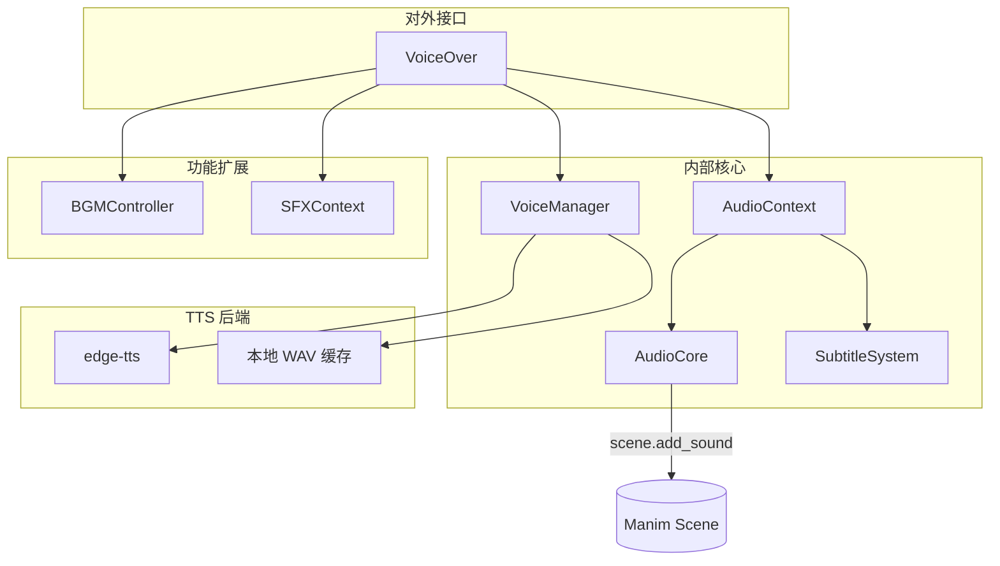

# Module: `manim_singularity.voiceover`

`voiceover` 包是 Manim 的听觉与字幕核心，提供 TTS 语音旁白、背景音乐、音效与字幕的完整方案。

---

## 架构总览



---

## 文件结构

```
manim_singularity/
  voiceover/
    __init__.py       # 导出 VoiceOver
    voiceover.py      # VoiceOver（唯一入口）
    core.py           # AudioCore（音频提交）
    subtitles.py      # SubtitleSystem（字幕渲染）
    manager.py        # VoiceManager（TTS+缓存）
    context.py        # AudioContext（with 块）
    bgm.py            # BGMController（背景音乐）
    sfx.py            # SFXContext（音效 with 块）
```

---

## 1. `VoiceOver` 类

### `__init__(scene, default_voice="zh-CN-XiaoxiaoNeural", show_subtitles=True, subtitle_kwargs=None)`

- **`scene`**: 当前 Manim `Scene` 实例。
- **`default_voice`**: 默认 Edge-TTS 音色。
- **`show_subtitles`**: 是否显示字幕。
- **`subtitle_kwargs`**: 传递给 `SubtitleSystem` 的参数（详见 SubtitleSystem）。

实例化后自动创建子控制器：`vo.bgm`（`BGMController`）

---

### `say_blocking(text, voice=None, offset=0.0, tts_text=None) -> float`

阻塞式解说。播放音频 + 字幕，读完后才继续执行。

| 参数 | 说明 |
|------|------|
| `text` | 字幕显示的文本 |
| `voice` | 临时覆盖音色 |
| `offset` | 播放前延迟（秒） |
| `tts_text` | 实际朗读文本（留空则读 `text`） |

**返回**: 音频时长（秒）。

```python
vo.say_blocking("大家好")
vo.say_blocking("AI", tts_text="人工智能")
```

---

### `context(text, voice=None, offset=0.0, tts_text=None) -> AudioContext`

返回 `with` 块上下文管理器，实现音画自动同步：动画时长 < 语音时长自动补齐等待，> 语音时长正常执行不截断。

```python
with vo.context("画一个完美的圆形"):
    circle = Circle(color=RED)
    self.play(Create(circle), run_time=1.0)
```

---

### `play_with_audio(*animations, text, voice=None, tts_text=None, **kwargs)`

将 `self.play()` 的 `run_time` 锁定为语音时长：

```python
vo.play_with_audio(Create(box), text="这是一个正方形")
```

---

### `sfx(path, volume=1.0, time_offset=0.0) -> SFXContext`

音效的 `with` 块上下文管理器。自动转 WAV，音量通过 FFmpeg 压入文件。

```python
with vo.sfx("explosion.wav", volume=0.8):
    self.play(Flash(center))
```

---

## 2. `AudioCore` 类

统一音频提交层。封装 `scene.add_sound()`，强制绕过 `skip_animations`。

```python
class AudioCore:
    def add_sound(self, path, **kwargs)
```

- `time_offset`: 相对于当前场景时间的偏移（秒），负值表过去时间点。
- `gain`: 音量增益。

---

## 3. `SubtitleSystem` 类

全参数化字幕引擎。通过 `VoiceOver(subtitle_kwargs={...})` 传入。

| 参数 | 默认值 | 说明 |
|------|--------|------|
| `font_size` | 32 | 字号 |
| `font` | None | 字体 |
| `color` | None | 单色（与 `gradient` 互斥） |
| `t2c` | None | 逐字着色字典 |
| `gradient` | `("#00E5FF","#0077FF")` | 渐变双色 |
| `position` | `DOWN` | 字幕位置 |
| `buff` | 0.5 | 边距 |
| `entrance_animation` | `Write` | 入场动画类型 |
| `entrance_run_time` | None | 入场时长（None 自动计算 `min(0.6, duration*0.3)`） |
| `exit_animation` | `FadeOut` | 离场动画类型 |
| `exit_run_time` | 0.3 | 离场时长 |
| `exit_shift` | `DOWN * 0.3` | 离场位移方向 |
| `weight` | `BOLD` | 字重 |
| `line_spacing` | 1.2 | 行距 |

```python
vo2 = VoiceOver(self, subtitle_kwargs={
    "font_size": 40,
    "color": "#FFAA00",
    "entrance_run_time": 0.3,
    "exit_shift": DOWN * 0.5,
})
vo2.say_blocking("定制字幕效果")
```

---

## 4. `VoiceManager` 类

TTS 音频生成 + 本地缓存。

- **流程**: `edge-tts` 生成 MP3 → FFmpeg 转码 WAV (PCM s16le, 44.1kHz)
- **缓存**: 基于朗读文本 + 音色生成 MD5，缓存于 `.voice_cache/`
- **tts_text**: 支持字幕文字与朗读文字分离

---

## 5. `AudioContext` 类

由 `VoiceOver.context()` 返回，内部调用 `AudioCore` 和 `SubtitleSystem`。

- `__enter__`: `AudioCore.add_sound()` 提交音频 → `SubtitleSystem` 创建字幕并入场
- `__exit__`: 补齐剩余时间 → 字幕离场 → 从固定帧移除

---

## 6. `BGMController` 类

背景音乐管理。通过 `vo.bgm` 访问。

| 方法 | 说明 |
|------|------|
| `add(path, loop=False, volume=1.0)` | 添加背景音乐（自动转 WAV） |
| `play()` | 开始或继续播放 |
| `pause()` | 暂停 |
| `stop()` | 停止 |
| `commit()` | 结算所有片段，提交到 scene（必须在 construct() 结束前调用） |

采用**分段记录，延迟提交**方案：play/pause 期间仅记录时间线，commit() 用 FFmpeg 裁切每段后统一提交。

```python
vo.bgm.add("background.mp3", loop=True, volume=0.5)
vo.bgm.play()
# ... scenes ...
vo.bgm.pause()
vo.bgm.play()
# ... scenes ...
vo.bgm.commit()
```

---

## 7. `SFXContext` 类

音效 `with` 块上下文管理器。通过 `vo.sfx()` 创建。

```python
with vo.sfx("explosion.wav", volume=0.8):
    self.play(Flash(center))
```

`with` 块内动画先结束则自动等待音效播完，音效先结束则不阻塞动画。

---

## 完整示例

```python
from manim_singularity import VoiceOver
from manim import *

class DemoScene(Scene):
    def construct(self):
        vo = VoiceOver(self)

        # 语音 + 字幕
        vo.say_blocking("大家好")
        vo.say_blocking("AI", tts_text="人工智能")

        # 音画同步
        with vo.context("画一个圆"):
            self.play(Create(Circle()), run_time=1.0)

        # 锁定时长
        vo.play_with_audio(Create(Square()), text="正方形")

        # 背景音乐
        vo.bgm.add("bgm.mp3", loop=True, volume=0.5)
        vo.bgm.play()
        vo.bgm.commit()

        # 音效 with 块
        with vo.sfx("explosion.wav", volume=0.8):
            self.play(Flash(center))

        # 定制字幕
        vo2 = VoiceOver(self, subtitle_kwargs={
            "font_size": 40,
            "color": "#FFAA00",
            "entrance_run_time": 0.3,
            "exit_shift": DOWN * 0.5,
        })
        vo2.say_blocking("定制字幕效果")
```
